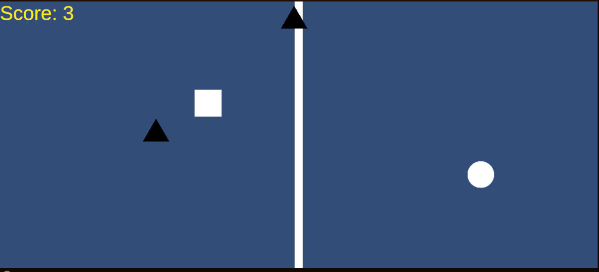

ゲーム制作技術総合実習 個人ワーク
（Circle, Triangle, Squareを使用した2Dゲーム）

# 脳トレ避けゲー

## ゲームの内容
画面を中央に存在する縦線で二つに分割し、左右それぞれに操作できる自キャラ（Square,Circle）がいる。
画面の上下左右から出てくる敵（Triangle）をよけ続けよう。
ゴールは無く、敵が画面外に出た時にスコアが加算されるスコア制だ。

## 操作説明
例
- 右側　上下左右で移動、左側　左と上が入れ替わり、右と下が入れ替わりで操作
- これだけ
